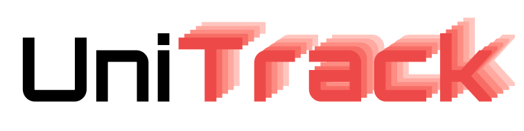

--------------------------------------------------------------------------------

[[ArXiv link]: Do different tracking tasks require different appearance model?](https://arxiv.org)

UniTrack is a simple and *Uni*fied framework for versatile visual *Track*ing tasks. 

As an important problem in computer vision, tracking has been fragmented into a multitude of different experimental setups. As a consequence, the literature has fragmented too, and now the novel approaches proposed by the community are usually specialized to fit only one specific setup. To understand to what extend this specialization is actually necessary, we present UniTrack, a solution to address multiple different tracking tasks within the same framework. All tasks share the same universal **appearance model**. UniTrack enjoys the following advantages,

- Good performance in existing tracking tasks, thus can serve as strong baselines for each task.

- Could be easily adapted to novel tasks with different setup.

- Could serve as an evaluation platform to test pre-trained (e.g. via self-supervised learning) representations on tracking tasks.

## Tasks & Framework

## Getting started

## Demo

