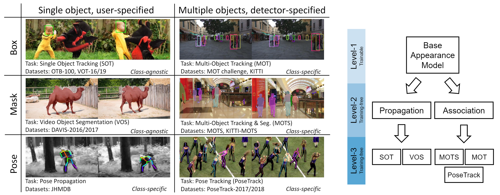
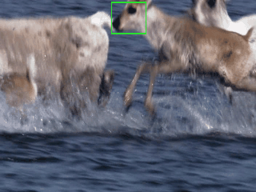
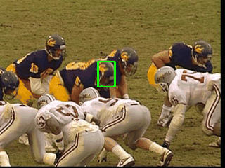
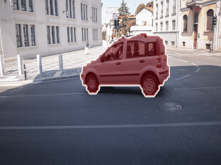
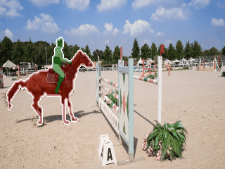
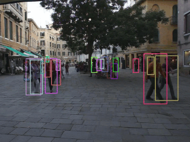
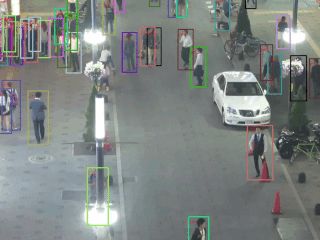
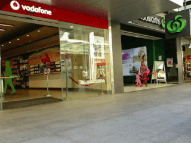
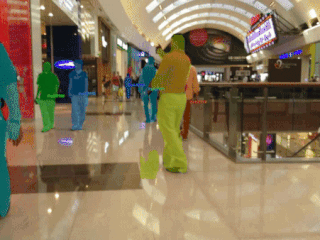
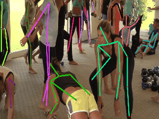

<p align="center">  

--------------------------------------------------------------------------------

**[NeurIPS 2021] Do different tracking tasks require different appearance model?**

**[[ArXiv](https://arxiv.org/pdf/2107.02156.pdf)]**  **[[Project Page](https://zhongdao.github.io/UniTrack)]**

UniTrack is a simple and Unified framework for addressing multiple tracking tasks. 

Being a fundamental problem in computer vision, tracking has been fragmented into a multitude of different experimental setups. As a consequence, the literature has fragmented too, and now the novel approaches proposed by the community are usually specialized to fit only one specific setup. To understand to what extend this specialization is actually necessary, we present UniTrack, a solution to address multiple different tracking tasks within the same framework. All tasks share the same [appearance model](#appearance-model). UniTrack

- Does **NOT** need training on a specific tracking task.

- Shows [competitive performance](docs/RESULTS.md) on six out of seven tracking tasks considered.

- Can be easily adapted to even [more tasks](##Demo).

- Can be used as an evaluation platform to [test pre-trained self-supervised models](docs/MODELZOO.md).
    
 
## Demo
**Multi-Object Tracking demo for 80 COCO classes ([YOLOX](https://github.com/Megvii-BaseDetection/YOLOX) + UniTrack)**
 

In this demo we run the YOLOX detector and perform MOT for the 80 COCO classes. Try the demo by:
```python
python demo/mot_demo.py --classes cls1 cls2 ... clsN
```
where cls1 to clsN represent the indices of classes you would like to detect and track. See [here](https://gist.github.com/AruniRC/7b3dadd004da04c80198557db5da4bda) for the index list. By default all 80 classes are detected and tracked.
    
## Tasks & Framework


### Tasks
We classify existing tracking tasks along four axes: (1) Single or multiple targets; (2) Users specify targets or automatic detectors specify targets; (3) Observation formats (bounding box/mask/pose); (2) Class-agnostic or class-specific (i.e. human/vehicles). We mainly experiment on 5 tasks: **SOT, VOS, MOT, MOTS, and PoseTrack**. Task setups are summarized in the above figure.

### Appearance model
An appearance model is the only learnable component in UniTrack. It should provide universal visual representation, and is usually pre-trained on large-scale dataset in supervised or unsupervised manners. Typical examples include ImageNet pre-trained ResNets (supervised), and recent self-supervised models such as MoCo and SimCLR (unsupervised).

### Propagation and Association
*Propagation* and *Association* are the two core primitives used in UniTrack to address a wide variety of tracking tasks (currently 7, but more can be added), Both use the features extracted by the pre-trained appearance model. For propagation, we adopt exiting methods such as [cross correlation](https://www.robots.ox.ac.uk/~luca/siamese-fc.html), [DCF](https://openaccess.thecvf.com/content_cvpr_2017/html/Valmadre_End-To-End_Representation_Learning_CVPR_2017_paper.html), and [mask propation](https://github.com/ajabri/videowalk). For association we employ a simple algorithm as in [JDE](https://github.com/Zhongdao/Towards-Realtime-MOT) and develop a novel reconstruction-based similairty metric that allows to compare objects across shapes and sizes.
    
    
## Getting started

1. Installation: Please check out [docs/INSTALL.md](docs/INSTALL.md)
2. Data preparation: Please check out [docs/DATA.md](docs/DATA.md)
3. Appearance model preparation: Please check out [docs/MODELZOO.md](docs/MODELZOO.md)
4. Run evaluation on all datasets: Please check out [docs/RUN.md](docs/RUN.md)

## Results
Below we show results of UniTrack with a simple **ImageNet Pre-trained ResNet-18** as the appearance model. More results (quantitative results, results on other tasks/datasets, and more visualization) can be found in [RESULTS.md](RESULTS.md).

**Single Object Tracking (SOT) on OTB-2015**

  

**Video Object Segmentation (VOS) on DAVIS-2017 *val* split**

  

**Multiple Object Tracking (MOT) on MOT-16 [*test* set *private detector* track](https://motchallenge.net/method/MOT=3856&chl=5)** (Detections from FairMOT)

  

**Multiple Object Tracking and Segmentation (MOTS) on MOTS challenge [*test* set](https://motchallenge.net/method/MOTS=109&chl=17)** (Detections from COSTA_st)

  

**Pose Tracking on PoseTrack-2018 *val* split** (Detections from LightTrack)

  


## Update log

[2021.07.31]: Add Mulit-class Multi-Object Tracking demo (UniTrack+YOLOX).
    
[2021.07.05]: Paper released on [arXiv](https://arxiv.org/pdf/2107.02156.pdf).

[2021.06.24]: Start writing docs, please stay tuned!

## Acknowledgement
[VideoWalk](https://github.com/ajabri/videowalk) by Allan A. Jabri

[SOT code](https://github.com/JudasDie/SOTS) by Zhipeng Zhang
